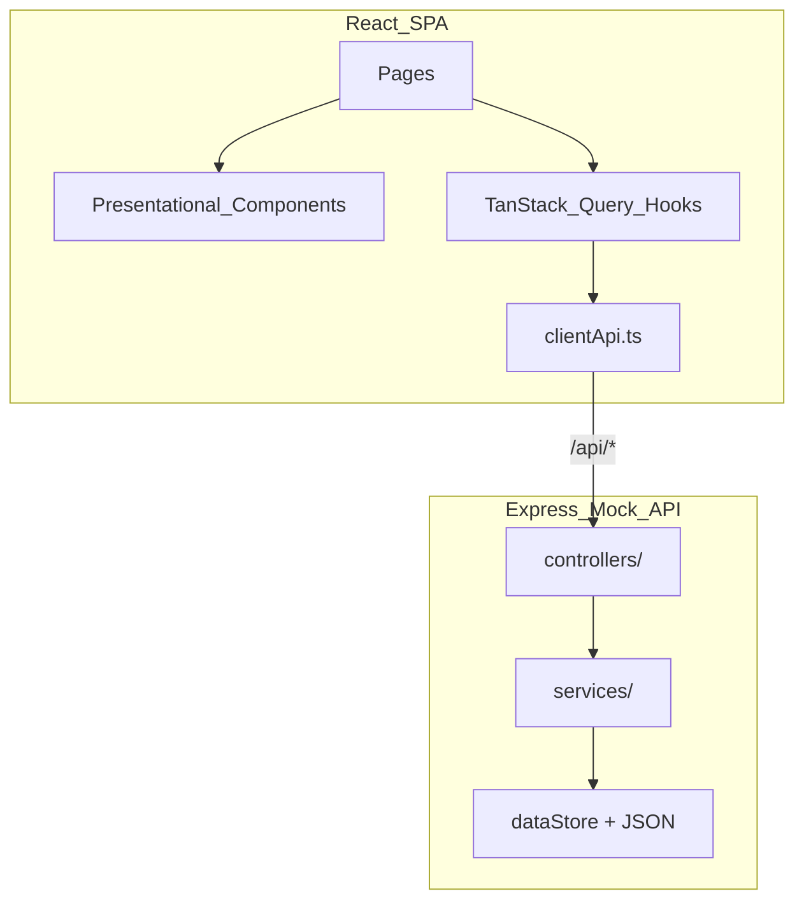

# Portfolio Pulse — Codebase Context

> **Maintenance:** Update this file when you add routes, API endpoints, major folders, or change architectural conventions. Keep in sync with [`CLAUDE.md`](CLAUDE.md) and [`docs/CODEBASE_CONTEXT.md`](docs/CODEBASE_CONTEXT.md).

---

## 1. Project Summary

**Portfolio Pulse** is an internal wealth management dashboard for Relationship Managers (RMs). It shows a morning overview of HNI client portfolios, drill-down analytics, and a rules-based rebalancing engine.

| Item | Detail |
|------|--------|
| **Repo root** | `neo-wealth/` (all paths below are relative to this folder) |
| **Requirements source** | [`PortfolioPulse_CaseStudy 1.docx`](PortfolioPulse_CaseStudy%201.docx) |
| **Human docs** | [`README.md`](README.md) — setup, design decisions, submission notes |

---

## 2. Tech Stack

| Layer | Technology |
|-------|------------|
| Frontend | React 19, Vite 8, TypeScript (strict) |
| Routing | React Router v7 |
| Server state | TanStack Query v5 |
| Charts | Recharts |
| Styling | CSS Modules + centralized [`src/styles/theme.css`](src/styles/theme.css) |
| Backend | Express 5, Node.js, `tsx` |
| Data | JSON fixtures in `server/data/` (no database) |
| Lint | ESLint 10 + `typescript-eslint` |

**Path alias:** `@/*` → `src/*` (see `tsconfig.json`, `vite.config.ts`).

---

## 3. Architecture



**Principles:**

- **Smart vs presentational** — Pages and hooks fetch data; components receive typed props only.
- **Server owns business logic** — Drift detection and recommendations run in `server/services/`; the UI displays computed results.
- **No mock data in React** — All financial data comes from the Express API.

**Provider tree:** `AppErrorBoundary` → `QueryProvider` → `BrowserRouter` → `AppRoutes` (see `App.tsx`, `providers/`).

---

## 4. Folder Structure

```
neo-wealth/
├── CLAUDE.md                    # Claude Code auto-load (mirror of this file)
├── docs/CODEBASE_CONTEXT.md     # This file
├── server/
│   ├── index.ts                 # Server entry, graceful shutdown
│   ├── createApp.ts             # Express app, CORS, routes, static (prod)
│   ├── constants.ts             # PORT, API_PREFIX, ALLOWED_ORIGINS
│   ├── controllers/             # HTTP handlers (thin)
│   ├── routes/                  # Route wiring (clients, health)
│   ├── services/                # Business logic + rebalancing engine
│   ├── middleware/              # Global error handler
│   ├── data/
│   │   ├── clients.json         # 7 HNI client summaries
│   │   ├── portfolios.json      # Allocations + holdings
│   │   ├── performance.json     # 6-month series
│   │   ├── dataStore.ts         # Load JSON, in-memory mutations
│   │   └── types.ts             # Raw record shapes
│   ├── types/index.ts           # Re-exports src/types
│   └── utils/routeParams.ts
├── src/
│   ├── api/                     # endpoints.ts, httpClient.ts, clientApi.ts
│   ├── components/{Name}/       # One folder per component + index.ts barrel
│   ├── constants/               # clientOverview, chartTheme, rebalancing
│   ├── hooks/                   # TanStack Query + useClientOverview
│   ├── pages/{Name}/            # Route-level pages
│   ├── providers/               # QueryProvider, AppProviders
│   ├── routes/AppRoutes.tsx
│   ├── styles/theme.css         # ALL color tokens (single source)
│   ├── types/                   # client.ts, portfolio.ts, api.ts
│   └── utils/                   # formatters, sortClients, getErrorMessage
├── index.html
├── vite.config.ts               # Proxy /api → localhost:3001
├── tsconfig.json                # Client TS
└── tsconfig.server.json         # Server TS
```

**Where to add new code:**

| Need | Location |
|------|----------|
| New page | `src/pages/{PageName}/` + route in `AppRoutes.tsx` |
| Reusable UI | `src/components/{ComponentName}/` |
| Data fetching | `src/hooks/use*.ts` + method in `src/api/clientApi.ts` |
| API endpoint | `server/routes/` → `server/controllers/` → `server/services/` |
| Mock data | `server/data/*.json` (never import in `src/`) |
| Shared types | `src/types/` (server re-exports via `server/types/`) |
| Colors / theme | `src/styles/theme.css` only |

---

## 5. Routes and API

### Frontend routes

| Path | Component | Purpose |
|------|-----------|---------|
| `/` | `ClientOverviewPage` | Client cards, sort, filter, alert badges |
| `/clients/:id` | `PortfolioDetailPage` | Charts, holdings, rebalancing panel |

### REST API (prefix `/api`)

| Method | Endpoint | Handler | Purpose |
|--------|----------|---------|---------|
| GET | `/api/health` | `healthRouter` | Health check |
| GET | `/api/clients` | `getClients` | All client summaries + `requiresRebalance` |
| GET | `/api/clients/:id/portfolio` | `getPortfolio` | Allocation, holdings, drifts, recommendations |
| GET | `/api/clients/:id/performance` | `getPerformance` | 6-month portfolio vs benchmark |
| POST | `/api/clients/:id/rebalance` | `postRebalance` | Body: `{ action: "reviewed" }` |

**Dev proxy:** Vite proxies `/api` → `http://localhost:3001`. **Production:** `npm run start` serves `dist/` + API on one port.

---

## 6. Key Modules Map

### Frontend

| Module | Role |
|--------|------|
| `api/clientApi.ts` | Typed wrappers for all endpoints |
| `api/httpClient.ts` | `requestJson`, `ApiError` class |
| `hooks/useClients.ts` | Client list query |
| `hooks/usePortfolio.ts` | Portfolio detail query |
| `hooks/usePerformance.ts` | Performance series query |
| `hooks/useRebalanceReview.ts` | POST reviewed mutation + cache invalidation |
| `hooks/useClientOverview.ts` | Sort/filter state for overview page |
| `hooks/useClientById.ts` | Resolve client name from cached list |
| `utils/formatters.ts` | AUM, percent formatting |
| `utils/portfolioFormatters.ts` | INR, gain/loss, chart dates |
| `utils/sortClients.ts` | Filter + sort pure functions |
| `constants/chartTheme.ts` | Reads chart colors from CSS vars at runtime |

### Backend

| Module | Role |
|--------|------|
| `services/rebalancingEngine.ts` | Orchestrates drift + recommendations |
| `services/driftCalculator.ts` | 5pp threshold rule |
| `services/recommendationBuilder.ts` | Buy/sell suggestions per instrument |
| `services/clientService.ts` | Client summaries with rebalance flags |
| `services/portfolioService.ts` | Full portfolio detail assembly |
| `services/rebalanceService.ts` | Mark-as-reviewed mutation |
| `data/dataStore.ts` | JSON load + in-memory `rebalanceReviewed` |

### Reusable UI components

`Button`, `Card`, `Badge`, `Select`, `Table`, `LoadingState`, `ErrorState`, `PageHeader`, `SectionTitle`, `ClientCard`, `ClientList`, `ClientFilters`, `ClientSortControls`, `AlertBadge`, `RiskProfileBadge`, `AssetAllocationChart`, `AllocationComparison`, `HoldingsTable`, `PerformanceChart`, `RebalancingPanel`, `BackLink`, `AppLayout`, `AppErrorBoundary`

---

## 7. Coding Conventions (MUST Follow)

1. **TypeScript strict** — No `any`; types in `src/types/`.
2. **Max 100 lines per file** — Split into helpers or column definition files if needed.
3. **Component folders** — `src/components/{Name}/{Name}.tsx` + `index.ts` barrel export.
4. **Page folders** — `src/pages/{Name}/{Name}.tsx` + optional `.module.css`.
5. **CSS colors** — Use `var(--token)` only; hex values live exclusively in `src/styles/theme.css`.
6. **DRY** — Reuse `Table`, `Select`, `Badge`, `Button`, `Card`, shared formatters.
7. **SOLID** — Pages/hooks = smart (data, state); components = presentational (props in, JSX out).
8. **No hardcoded financial data in React** — Always fetch via API.
9. **Server types** — Re-export from `src/types` via `server/types/index.ts`; do not duplicate interfaces.
10. **Shared constants** — `DRIFT_THRESHOLD_PP` in `src/constants/rebalancing.ts` (imported by server drift calculator).

---

## 8. Theme System

- **Single source:** [`src/styles/theme.css`](src/styles/theme.css) defines all `--color-*`, `--chart-*`, `--shadow-*` tokens.
- **Global styles:** [`src/index.css`](src/index.css) imports `theme.css` and sets resets (no color hex values).
- **Charts:** [`src/constants/chartTheme.ts`](src/constants/chartTheme.ts) reads CSS vars via `getComputedStyle(document.documentElement)` because Recharts needs JS color values.
- **Dark theme (WIP):** Partial `[data-theme="dark"]` block exists in `theme.css`. ThemeProvider, toggle UI, and localStorage persistence are **not yet implemented**.

To change the app look: edit `theme.css` only. To add dark mode: complete dark token overrides + add `ThemeProvider` + toggle (see dark-theme plan).

---

## 9. Implementation Status

### Completed (Phases 1–5)

- TypeScript migration, Vite + Express dual dev server
- Mock API with 7 clients, rebalancing engine, 4 REST endpoints
- Client overview: cards, sort, filter, alert badges
- Portfolio detail: allocation donut, target vs current, holdings table, performance chart, rebalancing panel
- Production polish: error boundary, health check, env config, ESLint + typescript-eslint
- README deliverable

### Partial / Pending

- Dark theme tokens started; toggle + persistence not built
- No unit tests
- No authentication
- No runtime API validation (Zod)

### Out of Scope (unless explicitly requested)

Per case study — do **not** add without user approval:

- CSV export, login screen, tablet-responsive layout
- Dark mode toggle (stretch goal — tokens started only)
- External/paid APIs, deployment config

---

## 10. Commands and Environment

```bash
npm install
npm run dev          # Vite :5173 + API :3001 (concurrently)
npm run build        # typecheck + Vite production build
npm run start        # Production: serves dist/ + API
npm run typecheck    # Client + server TS
npm run lint         # ESLint
```

| Variable | Default | Description |
|----------|---------|-------------|
| `VITE_API_BASE` | `/api` | Frontend API base URL |
| `PORT` | `3001` | Express server port |
| `ALLOWED_ORIGINS` | `http://localhost:5173` | CORS origins (comma-separated) |
| `NODE_ENV` | — | Set `production` for combined static + API |

See [`.env.example`](.env.example). **Never commit `.env` or secrets.**

---

## 11. Agent Guidelines

1. **Read the case study doc** before adding features — stay within documented scope unless told otherwise.
2. **Prefer extending existing components** over creating new abstractions.
3. **Colors → `theme.css` only.** Charts → update CSS vars + verify `chartTheme.ts` reads them.
4. **New API endpoint:** controller → service → dataStore; add client method + hook + types.
5. **Keep files under 100 lines** — extract column defs (`*Columns.tsx`) or utilities.
6. **Do not refactor working module structure** unless the task requires it.
7. **Invalidate TanStack Query caches** after mutations (see `useRebalanceReview` pattern).
8. **Use `getErrorMessage()`** from `src/utils/getErrorMessage.ts` for user-facing API errors.
9. **Do not commit** `.env`, credentials, or generated `dist/` / `node_modules/`.

---

## 12. Known Limitations

| Limitation | Detail |
|------------|--------|
| In-memory rebalance state | `rebalanceReviewed` lost on server restart |
| Client name on detail page | Resolved via cached full client list (`useClientById`), not a dedicated endpoint |
| No auth | All API routes are public |
| No runtime validation | API contract enforced by TypeScript only |
| Large JS bundle | Recharts not code-split; ~645 KB minified |
| Chart re-render | Theme changes require component remount (future dark mode work) |
| 10k clients | Would need pagination, DB, virtualization — see README scaling section |

---

## Quick Reference: Rebalancing Rule

```
drift = currentPct - targetPct
if |drift| > 5pp → flag overweight/underweight + generate buy/sell recommendations
```

Threshold constant: `DRIFT_THRESHOLD_PP = 5` in `src/constants/rebalancing.ts`.
