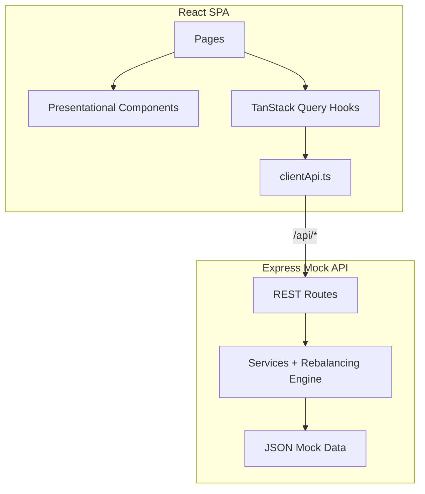

# Portfolio Pulse

Portfolio Pulse is an internal wealth management dashboard for Relationship Managers (RMs) at a private wealth firm. It provides a morning overview of assigned HNI client portfolios, drill-down portfolio analytics, and a rules-based rebalancing engine.

Built as a case study deliverable with production-minded architecture: typed React frontend, Express mock API, realistic seed data, and clear separation between UI, data fetching, and business logic.

---

## Features

- **Client Portfolio Overview** — card grid with AUM, 1M/YTD returns, risk profile, and rebalance alert badges
- **Sort & filter** — by AUM, returns, risk profile; filter by Conservative / Moderate / Aggressive
- **Portfolio Detail** — asset allocation donut, target vs current comparison, holdings table
- **Performance chart** — 6-month portfolio value vs benchmark (Nifty 50 / S&P 500)
- **Rebalancing engine** — flags >5pp allocation drift; buy/sell recommendations; mark-as-reviewed flow
- **Mock REST API** — `GET /clients`, `GET /clients/:id/portfolio`, `GET /clients/:id/performance`, `POST /clients/:id/rebalance`

---

## Architecture Overview



**Design principles:**
- **Smart vs presentational** — pages/hooks own data; components receive typed props
- **Single source of truth** — drift logic lives on the server; UI consumes computed `drifts` and `requiresRebalance`
- **DRY** — shared `Table`, `Select`, `Badge`, formatters, and rebalancing threshold constant

---

## Folder Structure

```
neo-wealth/
├── server/                 # Express mock API
│   ├── controllers/        # HTTP handlers
│   ├── data/               # JSON fixtures + in-memory store
│   ├── middleware/         # Error handling
│   ├── routes/             # Route definitions
│   ├── services/           # Business logic + rebalancing engine
│   └── index.ts            # Server entry
├── src/
│   ├── api/                # Typed fetch client
│   ├── components/         # Reusable UI (one folder per component)
│   ├── constants/          # App + chart + rebalancing constants
│   ├── hooks/              # TanStack Query hooks
│   ├── pages/              # Route-level pages
│   ├── providers/          # React Query + Router providers
│   ├── routes/             # React Router config
│   ├── types/              # Shared TypeScript interfaces
│   └── utils/              # Pure helpers (formatters, sorting)
├── index.html
├── vite.config.ts
└── package.json
```

---

## Tech Stack

| Layer | Choice | Why |
|-------|--------|-----|
| Frontend | React 19 + Vite 8 | Fast dev, modern React |
| Language | TypeScript (strict) | Type safety across client + shared types |
| Routing | React Router v7 | Overview + detail drill-down |
| Server state | TanStack Query | Loading/error/cache for REST calls |
| Charts | Recharts | Declarative React charts for donut + line |
| Styling | CSS Modules | Scoped styles without extra runtime |
| Backend | Express 5 | Mock API per case study requirements |

---

## Installation

**Requirements:** Node.js 20+

```bash
git clone <repository-url>
cd neo-wealth
npm install
```

---

## Environment Variables

Copy `.env.example` to `.env` if needed:

| Variable | Default | Description |
|----------|---------|-------------|
| `VITE_API_BASE` | `/api` | Frontend API base URL |
| `PORT` | `3001` | Express server port |
| `ALLOWED_ORIGINS` | `http://localhost:5173` | Comma-separated CORS origins |
| `NODE_ENV` | — | Set to `production` for combined static + API server |

---

## Running Locally

**Development** (Vite on `:5173`, API on `:3001`, proxy enabled):

```bash
npm run dev
```

Open [http://localhost:5173](http://localhost:5173)

**Production build + run** (single server serves `dist/` + API):

```bash
npm run build
npm run start
```

Open [http://localhost:3001](http://localhost:3001)

---

## Build & Quality Checks

```bash
npm run typecheck   # Strict TS for client + server
npm run build       # Typecheck + Vite production build
npm run lint        # ESLint (JS/TS config)
```

---

## Key Design Decisions

1. **Vite + Express over Next.js** — Keeps API as an explicit boundary; matches case study flexibility while using React SPA.
2. **Recharts** — Good defaults for financial line/donut charts with minimal custom D3 work.
3. **TanStack Query** — Handles loading, error, retry, and cache invalidation without Redux overhead.
4. **Server-side rebalancing** — Drift detection and recommendations computed once in Express; frontend stays presentational.
5. **JSON mock data** — Realistic Indian/global instrument names; in-memory `rebalanceReviewed` mutation for demo flows.
6. **Shared drift threshold** — `DRIFT_THRESHOLD_PP = 5` used by both server engine and UI badges.

---

## Trade-offs

| Decision | Trade-off |
|----------|-----------|
| Mock JSON vs database | Faster to build; state lost on restart |
| No auth | Acceptable for case study; not production-safe |
| Client list fetch on detail page | Reuses cache for client name; extra request on deep-link |
| No runtime schema validation (Zod) | Faster delivery; API contract enforced by TypeScript only |
| No unit tests | Focus on feature completeness within time box |
| Single bundle (no lazy routes) | Simpler setup; larger initial JS (Recharts) |

---

## Performance Optimizations

- React Query `staleTime: 30s`, `refetchOnWindowFocus: false` — reduces redundant dashboard polling
- `AbortSignal` forwarded to `fetch` — cancels in-flight requests on navigation
- CSS Modules — no runtime CSS-in-JS overhead
- Server computes drift/recommendations once per request — no duplicate client-side engine

**Future:** lazy-load `PortfolioDetailPage` + Recharts via `React.lazy()` to shrink initial bundle.

---

## What Breaks at 10,000 Clients?

| Bottleneck | Fix |
|------------|-----|
| Client list payload | Server-side pagination, sort, filter |
| Overview render | Virtualized list (`react-window`) |
| JSON file storage | Indexed DB / PostgreSQL with query indexes |
| In-memory rebalance state | Persistent store + transactional updates |
| Chart data volume | Aggregated endpoints; downsample time series |
| Single Express process | Horizontal scaling behind load balancer + shared DB |

---

## Future Improvements

- Authentication (RM login) and role-based access
- Runtime API validation (Zod) shared client/server
- Unit tests for rebalancing engine and formatters
- Route-level code splitting for Recharts
- `GET /clients/:id` endpoint to avoid full list fetch on detail page
- Persistent rebalance review audit log
- Dark mode, CSV export (stretch goals from case study)

---

## License

Private — case study submission.
